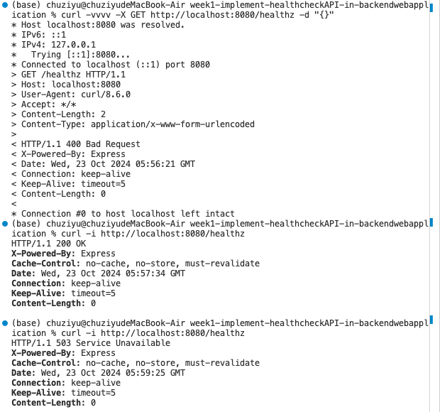

# Web Application

## Prerequisites
- Node.js (v16 or higher)
- MySQL database

## Build and Deploy Instructions
1. Clone the repository.
2. Install dependencies:
   ```bash
   npm install

## Start the Application
- node app.js

## Access the health check endpoint
- curl -vvvv http://localhost:8080/healthz

## Test your API
1. Run your application:
    ```bash
    node app.js
2. Test your health check API using the following commands:
    Successful Health Check:
    - curl -vvvv http://localhost:8080/healthz
    Check for Bad Request:
    - curl -vvvv -X GET http://localhost:8080/healthz -d "{}"
    Simulate Service Unavailable:
    - You can temporarily shut down your MySQL server to test the 503 Service Unavailable response.
    - mysqladmin -u root -p shutdown

## Git and Github Workflow
1.	Initialize a Git repository and commit your changes:
    - git init
    - git add .
    - git commit -m "Initial commit"

